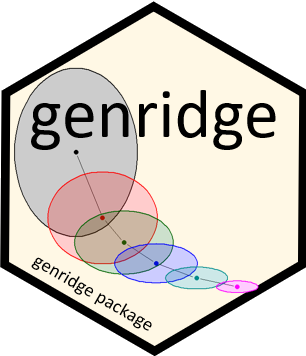
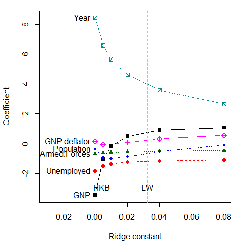
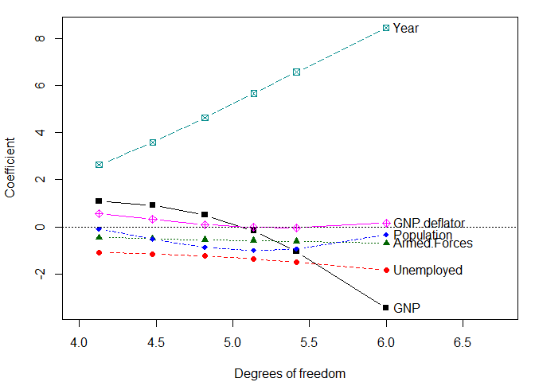
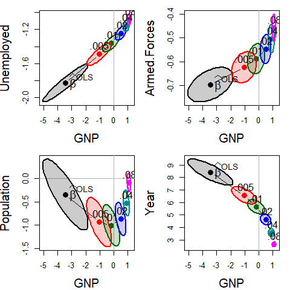
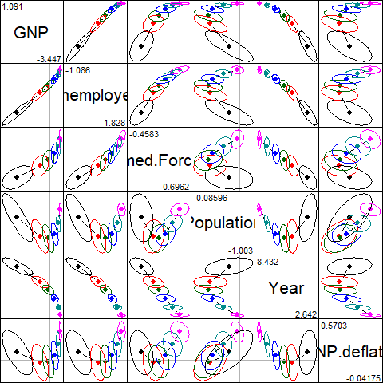
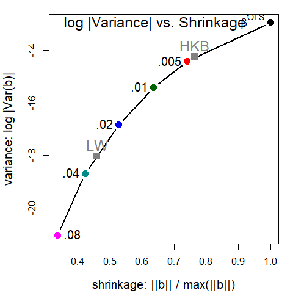
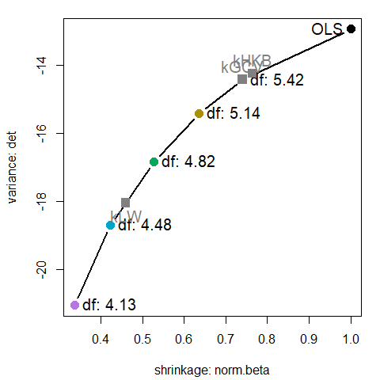
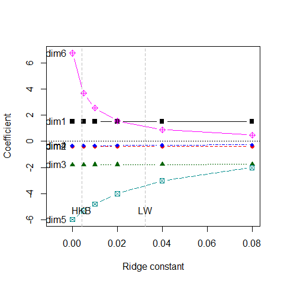
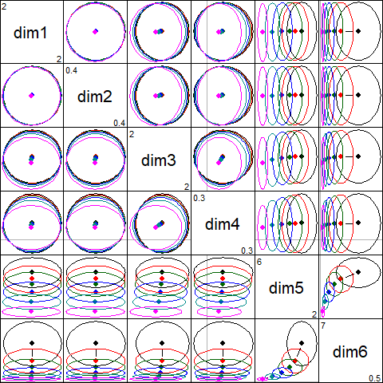

<!-- README.md is generated from README.Rmd. Please edit that file -->
<!-- badges: start -->

[](https://zenodo.org/badge/latestdoi/105555707)
[](https://cran.r-project.org/package=genridge)
[](https://friendly.r-universe.dev)
[](https://cran.r-project.org/package=genridge)
[](https://friendly.github.io/genridge)

<!-- badges: end -->

# genridge 

## Generalized Ridge Trace Plots for Ridge Regression

<!-- Version 0.7.1 -->

Version 0.7.2

### What is ridge regression?

Consider the standard linear model,
$\mathbf{y} = \mathbf{X} \; \mathbf{\beta} + \mathbf{\epsilon}$ for $p$
predictors in a multiple regression. In this context, high multiple
correlations among the predictors lead to well-known problems of
collinearity under ordinary least squares (OLS) estimation, which result
in unstable estimates of the parameters in β: standard errors are
inflated and estimated coefficients tend to be too large in absolute
value on average.

Ridge regression is an instance of a class of techniques designed to
obtain more favorable predictions at the expense of some increase in
bias, compared to ordinary least squares (OLS) estimation. An essential
idea behind these methods is that the OLS estimates are constrained in
some way, shrinking them, on average, toward zero, to satisfy increased
predictive accuracy.

The OLS estimates, which minimize the sum of squared residuals
$RSS = \Sigma \mathbf{\epsilon}^2$ are given by: $$
\widehat{\mathbf{\beta}}^{\mathrm{OLS}} = (\mathbf{X}^\top \mathbf{X})^{-1} \mathbf{X}^\top \mathbf{y} \; ,
$$ with
$\widehat{\text{Var}} (\widehat{\mathbf{\beta}}^{\mathrm{OLS}}) = \widehat{\sigma}^2 (\mathbf{X}^\top \mathbf{X})^{-1}$.

Ridge regression replaces the standard residual sum of squares criterion
with a penalized form,

$$
\mathrm{RSS}(\lambda) = (\mathbf{y}-\mathbf{X} \mathbf{\beta})^\top  (\mathbf{y}-\mathbf{X} \mathbf{\beta}) + \lambda \mathbf{\beta}^\top \mathbf{\beta} \quad\quad (\lambda \ge 0) \: ,
$$

whose solution is easily seen to be:

$$
\widehat{\mathbf{\beta}}^{\mathrm{RR}}_k  = (\mathbf{X}^\top \mathbf{X} + \lambda \mathbf{I})^{-1} \mathbf{X}^\top \mathbf{y}  
$$

where $\lambda$ is the *shrinkage factor* or *tuning constant*,
penalizing larger coefficients. Shrinkage can also be expressed as the
equivalent degrees of freedom, the trace of the analog of the “hat”
matrix,
$\text{tr}[(\mathbf{X}^\top \mathbf{X} + \lambda \mathbf{I})^{-1} \mathbf{X}^\top]$.
In general,

- The bias increases as λ increases,
- The sampling variance decreases as λ increases.

One goal of the `genridge` package is to provide visualization methods
for these models to help understand the tradeoff between bias and
variance and choice of a shrinkage value $\lambda$.

### Package overview

The `genridge` package introduces generalizations of the standard
univariate ridge trace plot used in ridge regression and related methods
(Friendly, 2011, 2013). These graphical methods show both bias
(actually, shrinkage) and precision, by plotting the covariance
ellipsoids of the estimated coefficients, rather than just the estimates
themselves. 2D and 3D plotting methods are provided, both in the space
of the predictor variables and in the transformed space of the PCA/SVD
of the predictors.

### Details

This package provides computational support for the graphical methods
described in Friendly (2013). Ridge regression models may be fit using
the function `ridge`, which incorporates features of `MASS::lm.ridge()`
and `ElemStatLearn::simple.ridge()`. In particular, the shrinkage
factors in ridge regression may be specified either in terms of the
constant ($\lambda$) added to the diagonal of $X^\top X$ matrix, or the
equivalent number of degrees of freedom.

The following computational functions are provided:

- `ridge()` Calculates ridge regression estimates; returns an object of
  class `"ridge"`
- `pca.ridge()` Transform coefficients and covariance matrices to
  PCA/SVD space; returns an object of class `c("pcaridge", "ridge")`
- `vif.ridge()` Calculates VIFs for “ridge” objects
- `precision()` Calculates measures of precision and shrinkage

More importantly, the `ridge` functions also calculate and returns the
associated covariance matrices of each of the ridge estimates, allowing
precision to be studied and displayed graphically.

This provides the support for the main plotting functions in the
package:

- `traceplot()`: Traditional univariate ridge trace plots
- `plot.ridge()`: Bivariate ridge trace plots, showing the covariance
  ellipse of the estimated coefficients.
- `pairs.ridge()`: All pairwise bivariate ridge trace plots
- `plot3d.ridge()`: 3D ridge trace plots with ellipsoids
- `plot.precision()`: Plots a measure of precsion vs. one of shrinkage

In addition, the `pca()` method for `"ridge"` objects transforms the
coefficients and covariance matrices of a ridge object from predictor
space to the equivalent, but more interesting space of the PCA of
$X^\top X$ or the SVD of $X$. The main plotting functions also work for
these objects, of class `c("ridge", "pcaridge")`.

- `biplot.pcaridge()`: Adds variable vectors to the bivariate plots of
  coefficients in PCA space

Finally, the functions `precision()` and `vif.ridge()` provide other
useful measures and plots.

## Installation

|  |  |
|----|----|
| CRAN version | `install.packages("genridge")` |
| R-universe | `install.packages("genridge", repos = c('https://friendly.r-universe.dev')` |
| Development version | `remotes::install_github("friendly/genridge")` |

## Examples

The classic example for ridge regression is Longley’s (1967) data,
consisting of 7 economic variables, observed yearly from 1947 to 1962
(n=16), in the data frame `datasets::longley`. The goal is to predict
`Employed` from `GNP`, `Unemployed`, `Armed.Forces`, `Population`,
`Year`, `GNP.deflator`.

These data, constructed to illustrate numerical problems in least
squares software at the time, are (purposely) perverse, in that:

- each variable is a time series so that there is clearly a lack of
  independence among predictors.
- worse, there is also some *structural collinearity* among the
  variables `GNP`, `Year`, `GNP.deflator`, `Population`, e.g.,
  `GNP.deflator` is a multiplicative factor to account for inflation.

``` r
data(longley)
str(longley)
#> 'data.frame':    16 obs. of  7 variables:
#>  $ GNP.deflator: num  83 88.5 88.2 89.5 96.2 ...
#>  $ GNP         : num  234 259 258 285 329 ...
#>  $ Unemployed  : num  236 232 368 335 210 ...
#>  $ Armed.Forces: num  159 146 162 165 310 ...
#>  $ Population  : num  108 109 110 111 112 ...
#>  $ Year        : int  1947 1948 1949 1950 1951 1952 1953 1954 1955 1956 ...
#>  $ Employed    : num  60.3 61.1 60.2 61.2 63.2 ...
```

Shrinkage values, can be specified using either $\lambda$ (where
$\lambda = 0$ corresponds to OLS), or equivalent effective degrees of
freedom. This quantifies the tradeoff between bias and variance for
predictive modeling, where OLS has low bias, but can have large
predictive variance.

`ridge()` returns a matrix containing the coefficients for each
predictor for each shrinkage value and other quantities.

``` r
lambda <- c(0, 0.005, 0.01, 0.02, 0.04, 0.08)
lridge <- ridge(Employed ~ GNP + Unemployed + Armed.Forces + Population + Year + GNP.deflator, 
        data=longley, lambda=lambda)
lridge
#> Ridge Coefficients:
#>        GNP        Unemployed  Armed.Forces  Population  Year       GNP.deflator
#> 0.000  -3.447192  -1.827886   -0.696210     -0.344197    8.431972   0.157380   
#> 0.005  -1.042478  -1.491395   -0.623468     -0.935580    6.566532  -0.041750   
#> 0.010  -0.179797  -1.361047   -0.588140     -1.003168    5.656287  -0.026122   
#> 0.020   0.499494  -1.245137   -0.547633     -0.867553    4.626116   0.097663   
#> 0.040   0.905947  -1.155229   -0.503911     -0.523471    3.576502   0.321240   
#> 0.080   1.090705  -1.086421   -0.458252     -0.085963    2.641649   0.570252
```

### Variance Inflation Factors

The effects of collinearity can be measured by a variance inflation
factor (VIF), the ratio of the sampling variances of the coefficients,
relative to what they would be if all predictors were uncorrelated,
given by $$
\text{VIF}(\beta_i) = \frac{1}{1 - R^2_{i | \text{others}}} \; ,
$$ where “others” represents all other predictors except $X_i$.

`vif()` for a `"ridge"` object calculates variance inflation factors for
all values of the ridge constant. You can see that for OLS, nearly all
VIF values are dangerously high. With a ridge factor of 0.04 or greater,
variance inflation has been considerably reduced for a few of the
predictors.

``` r
vif(lridge)
#> Variance inflaction factors:
#>            GNP  Unemployed  Armed.Forces  Population    Year  GNP.deflator
#> 0.000  1788.51      33.619         3.589      399.15  758.98        135.53
#> 0.005   540.04      12.118         2.921      193.30  336.15         90.63
#> 0.010   259.00       7.284         2.733      134.42  218.84         74.79
#> 0.020   101.12       4.573         2.578       87.29  128.82         58.94
#> 0.040    34.43       3.422         2.441       52.22   66.31         43.56
#> 0.080    11.28       2.994         2.301       28.59   28.82         29.52
```

### Univariate trace plots

A standard, univariate, `traceplot()` simply plots the estimated
coefficients for each predictor against the shrinkage factor, $\lambda$.

``` r
traceplot(lridge, xlim = c(-0.02, 0.08))
```

<figure>

<figcaption aria-hidden="true">Univariate ridge trace plot for the
coefficients of predictors of Employment in Longley’s data via ridge
regression, with ridge constants k = 0, 0.005, 0.01, 0.02, 0.04,
0.08.</figcaption>
</figure>

The dotted lines show choices for the ridge constant by two commonly
used criteria to balance bias against precision due to **HKB**: Hoerl,
Kennard, and Baldwin (1975) and **LW**: Lawless and Wang (1976). These
values (along with a generalized cross-validation value GCV) are also
stored in the `"ridge"` object,

``` r
c(HKB=lridge$kHKB, LW=lridge$kLW, GCV=lridge$kGCV)
#>      HKB       LW      GCV 
#> 0.004275 0.032295 0.005000
# these are also stored in 'criteria' for use with plotting methods
criteria <- lridge$criteria
```

These values seem rather small, but note that the coefficients for
`Year` and `GNP` are shrunk considerably.

### Alternative plot

It is sometimes easier to interpret the plot when coefficients are
plotted against the equivalent degrees of freedom, where $\lambda = 0$
corresponds to 6 degrees of freedom in the parameter space of six
predictors. Note that the values of $\lambda$ chosen here were
approximately chosen on a log scale. Using the scaling `X="df"` here
makes the points more nearly equally spaced.

``` r
traceplot(lridge, X="df", xlim = c(4, 6.5))
```

<figure>

<figcaption aria-hidden="true">Univariate ridge trace plot of
coefficients against effective degrees of freedom.</figcaption>
</figure>

**But wait: This is the wrong plot!** These plots show the trends in
increased bias associated with larger $\lambda$, but they do **not**
show the accompanying decrease in variance (increase in precision). For
that, we need to consider the variances and covariances of the estimated
coefficients. The univariate trace plot is the wrong graphic form for
what is essentially a *multivariate* problem, where we would like to
visualize how *both* coefficients and their variances change with
$\lambda$.

### Bivariate trace plots

The bivariate analog of the trace plot suggested by Friendly (2013)
plots **bivariate confidence ellipses** for pairs of coefficients. Their
centers, $(\widehat{\beta}_i, \widehat{\beta}_j)$ show the estimated
coefficients, and their size and shape indicate sampling variance,
$\widehat{\text{Var}} (\mathbf{\widehat{\beta}}_{ij})$. Here, we plot
those for `GNP` against four of the other predictors.

``` r
op <- par(mfrow=c(2,2), mar=c(4, 4, 1, 1)+ 0.1)
clr <-  c("black", "red", "darkgreen","blue", "cyan4", "magenta")
pch <- c(15:18, 7, 9)
lambdaf <- c(expression(~widehat(beta)^OLS), ".005", ".01", ".02", ".04", ".08")

for (i in 2:5) {
    plot(lridge, variables=c(1,i), 
         radius=0.5, cex.lab=1.5, col=clr, 
         labels=NULL, fill=TRUE, fill.alpha=0.2)
    text(lridge$coef[1,1], lridge$coef[1,i], 
         expression(~widehat(beta)^OLS), cex=1.5, pos=4, offset=.1)
    text(lridge$coef[-1,c(1,i)], lambdaf[-1], pos=3, cex=1.3)
}
par(op)
```

<div class="figure">


<p class="caption">
Bivariate ridge trace plots for the coefficients of four predictors
against the coefficient for GNP in Longley’s data, with λ = 0, 0.005,
0.01, 0.02, 0.04, 0.08. In most cases, the coefficients are driven
toward zero, but the bivariate plot also makes clear the reduction in
variance, as well as the bivariate path of shrinkage.
</p>

</div>

As can be seen, the coefficients for each pair of predictors trace a
path generally in toward the origin $(0, 0)$, and the covariance
ellipses get smaller, indicating increased precision.

The `pairs()` method for `"ridge"` objects shows all pairwise views in
scatterplot matrix form.

``` r
pairs(lridge, radius=0.5, diag.cex = 2, 
      fill = TRUE, fill.alpha = 0.1)
```

<div class="figure">


<p class="caption">
Scatterplot matrix of bivariate ridge trace plots
</p>

</div>

See Friendly et-al. (2013) for other examples of how elliptical thinking
can lead to insights in statistical problems.

### Visualizing the bias-variance tradeoff

The function `precision()` calculates a number of measures of the effect
of shrinkage of the coefficients on the estimated sampling variance.
Larger shrinkage $\lambda$ should lead to smaller
$\widehat{\text{Var}} (\mathbf{\widehat{\beta}})$, indicating increased
precision. See: `help(precision)` for details.

``` r
precision(lridge)
#>       lambda    df    det   trace max.eig norm.beta norm.diff
#> 0.000  0.000 6.000 -12.93 18.1190 15.4191    1.0000     0.000
#> 0.005  0.005 5.415 -14.41  6.8209  4.6065    0.7406     1.276
#> 0.010  0.010 5.135 -15.41  4.0423  2.1807    0.6365     1.783
#> 0.020  0.020 4.818 -16.83  2.2180  1.0255    0.5282     2.262
#> 0.040  0.040 4.478 -18.70  1.1647  0.5808    0.4233     2.679
#> 0.080  0.080 4.128 -21.05  0.5873  0.2599    0.3373     3.027
```

`norm.beta`
$= \lVert\mathbf{\beta}\rVert / \max{\lVert\mathbf{\beta}\rVert}$ is a
measure of shrinkage, and `det`
$= \log{| \text{Var}(\mathbf{\beta}) |}$, is a measure of variance of
the coefficients (inverse of precision). Plotting these against each
other gives a direct view of the tradeoff between bias and precision.

``` r
pridge <- precision(lridge)
op <- par(mar=c(4, 4, 1, 1) + 0.2)
library(splines)
with(pridge, {
    plot(norm.beta, det, type="b", 
    cex.lab=1.25, pch=16, cex=1.5, col=clr, lwd=2,
  xlab='shrinkage: ||b|| / max(||b||)',
    ylab='variance: log |Var(b)|')
    text(norm.beta, det, lambdaf, cex=1.25, pos=c(rep(2,length(lambda)-1),4), xpd = TRUE)
    text(min(norm.beta), max(det), "log |Variance| vs. Shrinkage", cex=1.5, pos=4)
    })
mod <- lm(cbind(det, norm.beta) ~ bs(lambda, df=5), data=pridge)
x <- data.frame(lambda=c(lridge$kHKB, lridge$kLW))
fit <- predict(mod, x)
points(fit[,2:1], pch=15, col=gray(.50), cex=1.5)
text(fit[,2:1], c("HKB", "LW"), pos=3, cex=1.5, col=gray(.50))
par(op)
```

<figure>

<figcaption aria-hidden="true">Plot of log(Variance) vs. shrinkage to
show the tradeoff between bias and variance.</figcaption>
</figure>

These plots are now provided in the `plot()` method for (class
`"precision"`) objects returned by `precision()`. This plots the measure
`norm.beta` on the horizontal axis vs. any of the variance measures
`det`, `trace`, or `max.eig`, and labels the points with either `k` or
`df`. See `help("precision")` for the definitions of these variance
measures.

A plot similar to that above can be produced as shown below, but here
labeling the points with effective degrees of freedom. The shape of the
curve is quite similar.

``` r
plot(pridge, labels = "df", label.prefix="df:", criteria = criteria)
```

<figure>

<figcaption aria-hidden="true">Plot of det(Variance) vs. shrinkage
(<code>norm.beta</code>) to show the tradeoff between bias and variance
using the <code>plot()</code> method for <code>'precision'</code>
objects. Points are labeled with the effective degrees of
freedom.</figcaption>
</figure>

## Low-rank views

Just as principal components analysis gives low-dimensional views of a
data set, PCA can be useful to understand ridge regression.

The `pca` method transforms a `"ridge"` object from parameter space,
where the estimated coefficients are $\beta_k$ with covariance matrices
$\Sigma_k$, to the principal component space defined by the right
singular vectors, $V$, of the singular value decomposition of the scaled
predictor matrix, $X$.

``` r
plridge <- pca(lridge)
plridge
#> Ridge Coefficients:
#>        dim1     dim2     dim3     dim4     dim5     dim6   
#> 0.000  1.51541  0.37939  1.80131  0.34595  5.97391  6.74225
#> 0.005  1.51531  0.37928  1.79855  0.33886  5.32221  3.68519
#> 0.010  1.51521  0.37918  1.79579  0.33205  4.79871  2.53553
#> 0.020  1.51500  0.37898  1.79031  0.31922  4.00988  1.56135
#> 0.040  1.51459  0.37858  1.77944  0.29633  3.01774  0.88291
#> 0.080  1.51377  0.37778  1.75810  0.25915  2.01876  0.47238
traceplot(plridge)
```

<!-- -->

What is perhaps surprising is that the coefficients for the first 4
components are not shrunk at all. Rather, the effect of shrinkage is
seen only on the *last two dimensions*. These are the directions that
contribute most to collinearity, for which other visualization methods
have been proposed (Friendly & Kwan 2009).

The `pairs()` plot illustrates the *joint* effects: the principal
components of $\mathbf{X}$ are uncorrelated, so the ellipses are all
aligned with the coordinate axes and the ellipses largely coincide for
dimensions 1 to 4:

``` r
pairs(plridge)
```



If we focus on the plot of dimensions `5:6`, we can see where all the
shrinkage action is in this representation. Generally, the predictors
that are related to the smallest dimension (6) are shrunk quickly at
first.

``` r
plot(plridge, variables=5:6, fill = TRUE, fill.alpha=0.2)
text(plridge$coef[, 5:6], 
       label = lambdaf, 
     cex=1.5, pos=4, offset=.1)
```

<!-- -->

### Biplot view

Finally, we can project the *predictor variables* into the PCA space of
the *smallest dimensions*, where the shrinkage action mostly occurs to
see how the predictor variables relate to these dimensions.

`biplot.pcaridge()` supplements the standard display of the covariance
ellipsoids for a ridge regression problem in PCA/SVD space with labeled
arrows showing the contributions of the original variables to the
dimensions plotted. The length of the arrows reflects proportion of
variance that each predictors shares with the components.

The biplot view showing the dimensions corresponding to the two smallest
singular values is particularly useful for understanding how the
predictors contribute to shrinkage in ridge regression. Here, `Year` and
`Population` largely contribute to `dim 5`; a contrast between (`Year`,
`Population`) and `GNP` contributes to `dim 6`.

``` r
op <- par(mar=c(4, 4, 1, 1) + 0.2)
biplot(plridge, radius=0.5, 
       ref=FALSE, asp=1, 
       var.cex=1.15, cex.lab=1.3, col=clr,
       fill=TRUE, fill.alpha=0.2, prefix="Dimension ")
#> Vector scale factor set to  5.247
text(plridge$coef[,5:6], lambdaf, pos=2, cex=1.3)
par(op)
```

<!-- -->

## Other examples

The genridge package contains four data sets, each with its own
examples; e.g., you can try `example(Acetylene)`.

``` r
vcdExtra::datasets(package="genridge")
#>        Item      class    dim                               Title
#> 1 Acetylene data.frame   16x4                      Acetylene Data
#> 2   Detroit data.frame  13x14 Detroit Homicide Data for 1961-1973
#> 3  Manpower data.frame   17x6              Hospital manpower data
#> 4      diab data.frame 442x11                Diabetes Progression
#> 5  prostate data.frame  97x10                Prostate Cancer Data
```

## References

Friendly, M. (2011). Generalized Ridge Trace Plots: Visualizing Bias
*and* Precision with the `genridge` R package. SCS Seminar, Jan., 2011.
Slides:
[gentalk.pdf](http://euclid.psych.yorku.ca/datavis/papers/gentalk.pdf);
[gentalk-2x2.pdf](http://euclid.psych.yorku.ca/datavis/papers/gentalk-2x2.pdf)

Friendly, M. (2013). The Generalized Ridge Trace Plot: Visualizing Bias
*and* Precision. *Journal of Computational and Graphical Statistics*,
**22**(1), 50-68, [DOI
link](http://dx.doi.org/10.1080/10618600.2012.681237), Online:
[genridge-jcgs.pdf](https://www.datavis.ca/papers/genridge-jcgs.pdf),
Supp. materials:
[genridge-supp.zip](http://datavis.ca/papers/genridge-supp.zip)

Friendly, M., and Kwan, E. (2009), Where’s Waldo: Visualizing
Collinearity Diagnostics, *The American Statistician*, **63**(1), 56–65,
[DOI link](https://doi.org/10.1198/tast.2009.0012), Online:
[viscollin-tast.pdf](http://datavis.ca/papers/viscollin-tast.pdf), Supp.
materials: <http://datavis.ca/papers/viscollin/>.

Friendly, M., Monette, G., & Fox, J. (2013). Elliptical Insights:
Understanding Statistical Methods Through Elliptical Geometry.
*Statistical Science*, **28**(1), 1–39.
<https://doi.org/10.1214/12-STS402>

Golub G.H., Heath M., Wahba G. (1979) Generalized cross-validation as a
method for choosing a good ridge parameter. *Technometrics*,
**21**:215–223. <https://doi.org/10.2307/1268518>.

Hoerl, A. E., Kennard, R. W., and Baldwin, K. F. (1975), Ridge
Regression: Some Simulations, *Communications in Statistics*, **4**,
105–123.

Lawless, J. F., and Wang, P. (1976), A Simulation Study of Ridge and
Other Regression Estimators, *Communications in Statistics*, **5**,
307–323.

Longley, J. W. (1967) An appraisal of least-squares programs from the
point of view of the user. *Journal of the American Statistical
Association*, **62**, 819–841.
