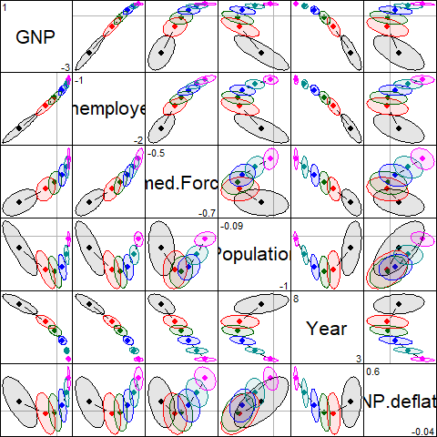
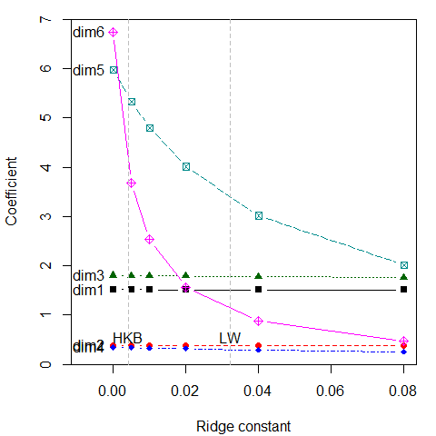
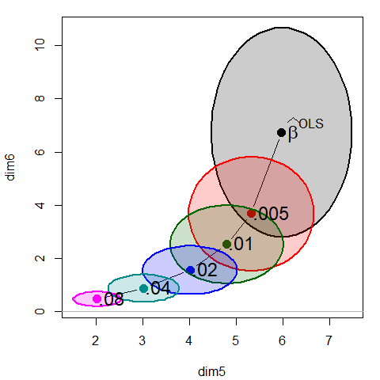

<!-- README.md is generated from README.Rmd. Please edit that file -->
<!-- badges: start -->

[](https://zenodo.org/badge/latestdoi/105555707)
[](https://cran.r-project.org/package=genridge)
[](https://cran.r-project.org/package=genridge)
<!-- badges: end -->

# genridge

## Generalized Ridge Trace Plots for Ridge Regression

Version 0.6-8

### Overview

The genridge package introduces generalizations of the standard
univariate ridge trace plot used in ridge regression and related methods
(Friendly, 2013) These graphical methods show both bias (actually,
shrinkage) and precision, by plotting the covariance ellipsoids of the
estimated coefficients, rather than just the estimates themselves. 2D
and 3D plotting methods are provided, both in the space of the predictor
variables and in the transformed space of the PCA/SVD of the predictors.

### Details

This package provides computational support for the graphical methods
described in Friendly (2013). Ridge regression models may be fit using
the function `ridge`, which incorporates features of `MASS::lm.ridge`
and `ElemStatLearn::simple.ridge`. In particular, the shrinkage factors
in ridge regression may be specified either in terms of the constant
($\lambda$) added to the diagonal of $X^T X$ matrix, or the equivalent
number of degrees of freedom.

More importantly, the `ridge` function also calculates and returns the
associated covariance matrices of each of the ridge estimates, allowing
precision to be studied and displayed graphically.

This provides the support for the main plotting functions in the
package:

- `plot.ridge`: Bivariate ridge trace plots

- `pairs.ridge`: All pairwise bivariate ridge trace plots

- `plot3d.ridge`: 3D ridge trace plots

- `traceplot`: Traditional univariate ridge trace plots

In addition, the function `pca.ridge` transforms the coefficients and
covariance matrices of a ridge object from predictor space to the
equivalent, but more interesting space of the PCA of $X^T X$ or the SVD
of X. The main plotting functions also work for these objects, of class
`c("ridge", "pcaridge")`.

Finally, the functions `precision` and `vif.ridge` provide other useful
measures and plots.

## Installation

Get the *released* version from CRAN:

     install.packages("genridge")

The *development* version can be installed to your R library directly
from this repo via:

     if (!require(devtools)) install.packages("devtools")
     library(devtools)
     install_github("friendly/genridge")

## Examples

The classic example for ridge regression is Longley’s (1967) data,
consisting of 7 economic variables, observed yearly from 1947 to 1962
(n=16), in the data frame `datasets::longley`. The goal is to predict
`Employed` from `GNP`, `Unemployed`, `Armed.Forces`, `Population`,
`Year`, `GNP.deflator`.

``` r
data(longley)
longley.y <- longley[, "Employed"]
longley.X <- data.matrix(longley[, c(2:6,1)])
```

Shrinkage values, can be specified using either `\lambda` (where
$\lambda = 0$ corresponds to ordinary least squares (OLS)), or
equivalent effective degrees of freedom. This quantifies the tradeoff
between bias and variance for predictive modeling, where OLS has low
bias, but can have large predictive variance.

`ridge` returns a matrix containing the coefficients for each predictor
for each shrinkage value.

``` r
lambda <- c(0, 0.005, 0.01, 0.02, 0.04, 0.08)
lridge <- ridge(longley.y, longley.X, lambda=lambda)
lridge
#> Ridge Coefficients:
#>        GNP        Unemployed  Armed.Forces  Population  Year       GNP.deflator
#> 0.000  -3.447192  -1.827886   -0.696210     -0.344197    8.431972   0.157380   
#> 0.005  -1.042478  -1.491395   -0.623468     -0.935580    6.566532  -0.041750   
#> 0.010  -0.179797  -1.361047   -0.588140     -1.003168    5.656287  -0.026122   
#> 0.020   0.499494  -1.245137   -0.547633     -0.867553    4.626116   0.097663   
#> 0.040   0.905947  -1.155229   -0.503911     -0.523471    3.576502   0.321240   
#> 0.080   1.090705  -1.086421   -0.458252     -0.085963    2.641649   0.570252
```

Do the same, using formula interface:

``` r
lridge <- ridge(Employed ~ GNP + Unemployed + Armed.Forces + Population + Year + GNP.deflator, 
        data=longley, lambda=lambda)
```

## Variance Inflation Factors

`vif()` for a `"ridge"` object calculates variance inflation factors for
all values of the ridge constant. You can see that for OLS
($\lambda = 0$), nearly all VIF values are dangeroulsly high. With a
ridge factor of 0.04 or greater, variance inflation has been
considerably reduced.

``` r
vif(lridge)
#>              GNP Unemployed Armed.Forces Population      Year GNP.deflator
#> 0.000 1788.51348  33.618891     3.588930  399.15102 758.98060    135.53244
#> 0.005  540.04391  12.118058     2.920757  193.29890 336.15377     90.62954
#> 0.010  258.99935   7.284398     2.732975  134.42069 218.84254     74.78548
#> 0.020  101.11696   4.572957     2.577977   87.29189 128.82070     58.93518
#> 0.040   34.42567   3.422139     2.440659   52.22396  66.31015     43.55638
#> 0.080   11.28144   2.994018     2.301110   28.59266  28.82089     29.52231
```

### Univariate trace plots

A standard, univariate, trace plot simply plots the estimated
coefficients for each predictor against the shrinkage factor, $\lambda$.

``` r
traceplot(lridge)
```

<!-- -->

It is sometimes easier to interpret the plot when coefficients are
plotted against the equivalent degrees of freedom, where $\lambda = 0$
corresponds to 6 degrees of freedom in the parameter space of six
predictors.

``` r
traceplot(lridge, X="df")
```

<!-- -->

These plots show the trends in increased bias associated with larger
$\lambda$, but they do not show the accompaning decrease in variance.
For that, we need to consider the variances and covariances of the
estimated coefficients.

### Bivariate trace plots

The bivariate analog of the trace plot suggested by Friendly (2013)
plots bivariate confidence ellipses for pairs of coefficients. Here, we
plot those for `GNP` against four of the other predictors.

``` r
op <- par(mfrow=c(2,2), mar=c(4, 4, 1, 1)+ 0.1)
clr <-  c("black", "red", "darkgreen","blue", "cyan4", "magenta")
pch <- c(15:18, 7, 9)
lambdaf <- c(expression(~widehat(beta)^OLS), ".005", ".01", ".02", ".04", ".08")

for (i in 2:5) {
    plot.ridge(lridge, variables=c(1,i), 
               radius=0.5, cex.lab=1.5, col=clr, 
               labels=NULL, fill=TRUE, fill.alpha=0.2)
    text(lridge$coef[1,1], lridge$coef[1,i], 
         expression(~widehat(beta)^OLS), cex=1.5, pos=4, offset=.1)
    text(lridge$coef[-1,c(1,i)], lambdaf[-1], pos=3, cex=1.3)
}
par(op)
```


The `pairs` method for `ridge` objects shows this in scatterplot matrix
form.

``` r
pairs(lridge, radius=0.5)
```



## Low-rank views

Just as principal components analysis gives low-dimensional views of a
data set, PCA can be useful to understand ridge regression.

The function `pca.ridge` transforms a `ridge` object from parameter
space, where the estimated coefficients are $\beta_k$ with covariance
matrices $\Sigma_k$, to the principal component space defined by the
right singular vectors, $V$, of the singular value decomposition of the
scaled predictor matrix, $X$.

``` r
plridge <- pca.ridge(lridge)
traceplot(plridge)
```

<!-- -->

what is perhaps surprising is that the coefficients for the first 4
components are not shrunk at all. Rather, the effect of ridge regression
is seen only on the last two dimensions.

``` r
pairs(plridge)
```


``` r
plot(plridge, variables=5:6, fill = TRUE, fill.alpha=0.2)
```

<!-- -->

## References

Friendly, M. (2013). The Generalized Ridge Trace Plot: Visualizing Bias
*and* Precision. *Journal of Computational and Graphical Statistics*,
**22**(1), 50-68, [doi
link](http://dx.doi.org/10.1080/10618600.2012.681237), Preprint:
[genridge.pdf](http://euclid.psych.yorku.ca/datavis/papers/genridge.pdf)

Longley, J. W. (1967) An appraisal of least-squares programs from the
point of view of the user. *Journal of the American Statistical
Association*, **62**, 819–841.
